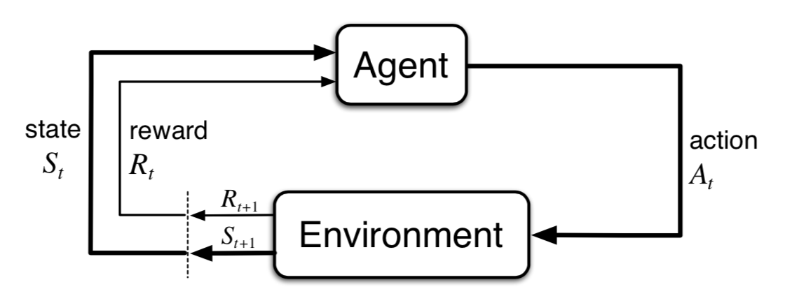
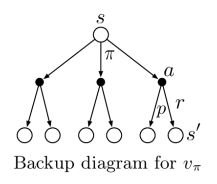
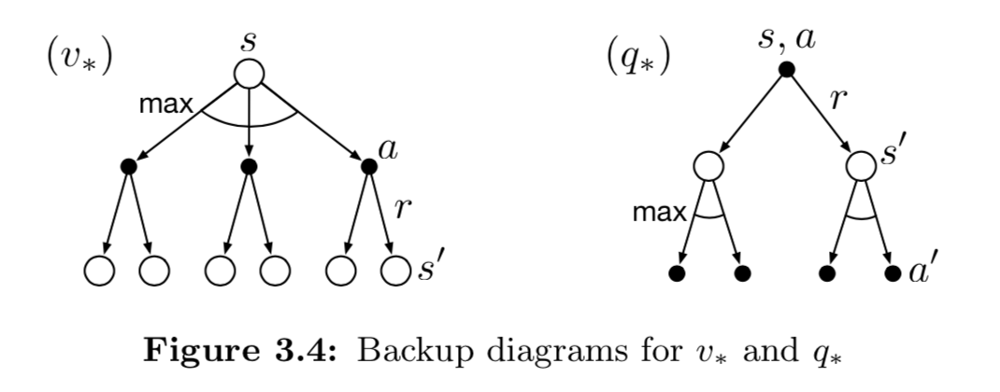

## Chapter 3: Finite Markov Decision Process

From k-armed bandit problem: single state $\Rightarrow$ multiple state.

### 3.1 The Agent-Environment Interface

- **Agent**: The learner and decision maker 
- **Environment**: The thing it interacts with, comprising everything outside the agent

The **trajectory**:
$$
S_0,A_0,R_1,S_1,A_1,R_2,S_2,A_2,R_3,\dots
$$

#### Dynamics of MDP

Function $p$:
$$
p(s',r\mid s, a)\doteq\Pr\{S_t=s',R_t=r\mid S_{t-1}=s, A_{t-1}=a\}
$$
defines the *dynamics* of MDP. The conditional probability notation here is just a reminder of 
$$
\sum_{s'\in\mathcal{S}}\sum_{r\in\mathcal{R}}p(s',r\mid s,a)=1\text{, for all }s\in\mathcal{S}, a\in\mathcal{A}(s)
$$
This *dynamics* is not a constraint on the decision process but rather a constraint on states, which means the states must contains all informations of past states and actions. This property is called a *Markov property*.

The four-argument dynamics function $p$ has some other useful forms.

- *state-transition probabilities*:
  $$
  p(s'\mid s,a)=\Pr\{S_t=s'\mid S_{t-1}=s, A_{t-1}=a\}=\sum_{r\in\mathcal{R}}p(s',r\mid s, a)
  $$

- expected reward:

- $$
  r(s, a)=\mathbb{E}[R_t\mid S_{t-1}=s, A_{t-1}=a]=\sum_{r\in\mathcal{R}}r\sum_{s\in\mathcal{S}}p(s',r\mid s, a)
  $$

  $$
  r(s, a, s')=\mathbb{E}[R_t\mid S_{t-1}=s, A_{t-1}=a, S_t=s]=\sum_{r\in\mathcal{R}}r\frac{p(s',r\mid s, a)}{p(s'\mid s,a)}
  $$

#### The agent-environment boundary

- The boundary represents the limit of the agent's *absolute control*, not of its knowledge.
- The boundary is determined once one has selected particular states, actions, and rewards, and thus has identified a specific decision making task of interest 

### 3.2 Goals and Rewards

**Reward hypothesis**: That all of what we mean by goals and purposes can be well thought of as the maximization of the expected value of the cumulative sum of a received scalar signal (called reward). 

The reward signal is your way of communicating to the robot *what* you want it to achieve, not *how* you want it achieved.

### 3.3 Returns and Episodes

- **Return**:
  $$
  G_t\doteq R_{t+1}+R_{t+2}+R_{t+3}+\cdots+R_T
  $$
  Where $T$ is a final time step.

- **Episode**: the agent–environment interaction breaks naturally into subsequences 

- **Episodic tasks**: Tasks with episodes (finite time step)

- **Continuous tasks**: Final stime step $T=\infty$, the return form above may easily result in inifity reward.

- **Discounted return**:
  $$
  \begin{aligned}
  G_t&\doteq R_{t+1}+\gamma R_{t+2}+\gamma^2R_{t+3}+\cdots=\sum_{k=0}^\infty\gamma^kR_{t+k+1}\\
  &=R_{t+1}+\gamma G_{t+1}
  \end{aligned}
  $$

### 3.5 Policies and Value Functions

- **Policy**: 

- $$
  \pi(a| s)=\Pr[A_t=a\mid S_t=s]
  $$

- **State-value function for policy $\pi$**:

- $$
  v_{\pi}(s)\ \doteq\ \mathbb{E}_\pi[G_t\mid S_t=s]\ =\ \mathbb{E}_\pi\left[\left.\sum_{k=0}^\infty\gamma^kR_{t+k+1}\right\vert S_t=s\right]\text{ , for all }s\in\mathcal{S}
  $$

- **State-value function for policy $\pi$**:

- $$
  q_\pi(s,a)\ \doteq\ \mathbb{E}_\pi[G_t\mid S_t=s, A_t=a]\ =\ \mathbb{E}_\pi\left[\left.\sum_{k=0}^\infty\gamma^kR_{t+k+1}\right|S_t=s, A_t=a\right]
  $$

- **Monte Carlo methods**: fix $\pi$, averaging over random samples of $v_\pi$ or $q_\pi$.

When state space is too large, we can maintain $v_\pi$ and $q_\pi$ as parameterized functions (with fewer parameters than states).

Value functions also have recursive relationships, thus can be applied in dynamic programming.

- **Bellman Equation**

- $$
  \begin{aligned}
  v_\pi(s)&\doteq \mathbb{E}_\pi[G_t\mid S_t=s]\\
  &=\mathbb{E}_\pi[R_{t+1}+\gamma G_{t+1}\mid S_t=t]\\
  &=\sum_a\pi(a\mid s)\sum_{s'}\sum_r p(s', r\mid s,a)[r+\gamma\mathbb{E}_\pi[G_{t+1}\mid S_{t+1}=s']]\\
  &=\sum_a\pi(a\mid s)\sum_{s',r} p(s', r\mid s,a)[r+\gamma v_\pi(s')]\\
  \\
  q_\pi(s, a)&\doteq\mathbb{E}_\pi[G_t\mid S_t=s, A_t=a]\\
  &=\sum_{s',r}p(s',r\mid s,a)\left[r+\gamma\sum_{a'}\pi(a'\mid s')q_\pi(s', a')\right]
  \end{aligned}
  $$

- **Backup (update) diagram**

  *Backup operations*: transfer value information back to a state (or a state–action pair) from its successor states (or state–action pairs) 

### 3.6 Optimal Policies and Optimal Value Functions 

Frist define a *partial order* between policies $\pi$ and $\pi'$:
$$
\pi \geq \pi'\text{ if and only if }v_\pi(s)\geq v_{\pi'}(s)\text{ for all } s\in\mathcal{S}
$$
There is always *at least one* policy that is better than or equal to all other policies. They all are **optimal policy** $\pi_*$. They share the same state-value function, called the **optimal state-value function** $v_*$:
$$
v_*(s)\doteq\max_\pi v_\pi(s)\text{,  for all } s \in \mathcal{S}
$$
and **optimal action-value function** $q_*$:
$$
q_*(s,a)\doteq\max_\pi q_\pi(s, a)\text{, for all }s\in\mathcal{S}\text{ and }a\in\mathcal{A}(s)
$$
**Bellman optimality equation**:

- $$
  \begin{aligned}
  v_*(s)&=\max_{a\in\mathcal{A}(s)}q_*(s,a)\\
  &=\max_{a}\mathbb{E}_{\pi_*}[G_t\mid S_t=s, A_t=a]\\
  &=\max_{a}\mathbb{E}_{\pi_*}[R_{t+1}+\gamma G_{t+1}\mid S_t=s, A_t=a]\\
  &=\max_{a}\mathbb{E}[R_{t+1}+\gamma v_*(S_{t+1})\mid S_t=s, A_t=a]\\
  &=\max_a\sum_{s',r}p(s',r\mid s, a)[r+\gamma v_*(s')]\\
  \\
  q_*(s,a)&=\mathbb{E}[R_{t+1}+\gamma\max_{a'}q_*(S_{t+1},a')\mid S_t=s, A_t=a]\\
  &=\sum_{s',r}p(s',r\mid s,a)\left[r+\gamma\max_{a'}q_*(s',a')\right]
  \end{aligned}
  $$

  

### 3.7 Optimality and Approximation 

Solving optimality Bellman equation to solve RL problem is **impractical**, because

1. We have to accurately know environment dynamics ( $p(s', r\mid s, a)$).
2. The computational cost & memory required is massive.
3. The true Markov property is rare.

So *approximations* are often necessary.

1. parameterized function representation 
2. focues on frequently encountered states

