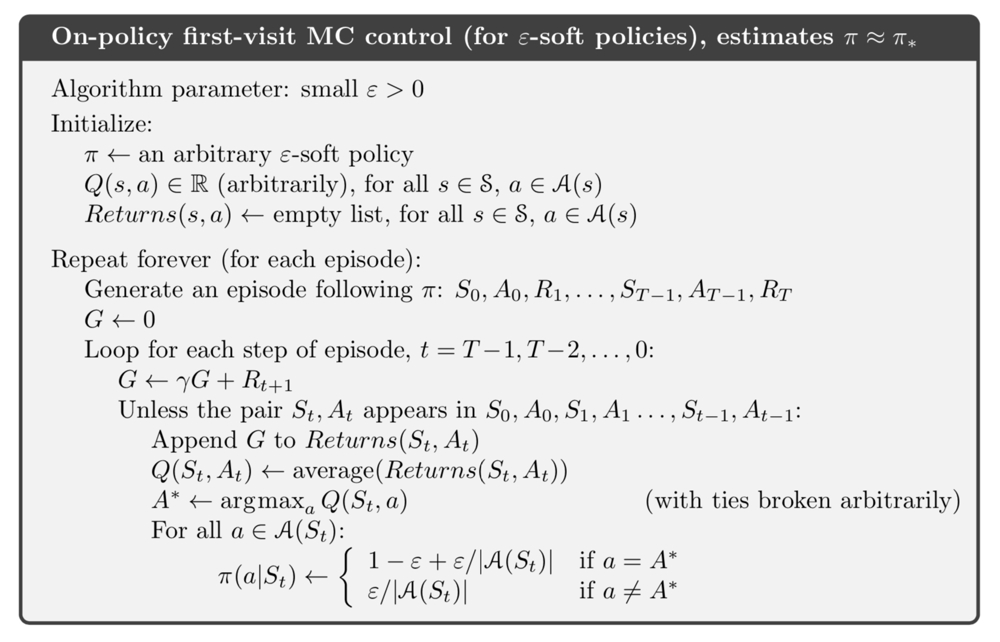

## Chapter 5: Monte Carlo Methods

### 5.1 Monte Carlo Prediction

- **First-visit MC method**: the return is taken by the first occurrence of $s$ in the episode.
- **Every-visit MC method**: the return is taken by every occurrences of $s$ in the episode.

In first-visit MC method, every sample of $V(s)$ are independent with each other.

1. Estimates for states are independent. (do not *bootstrap*)
2. Ability to learn from actual experience and from simulated experience.
3. Its computational expense of estimating the value of
   a single state is independent of the number of states.

### 5.2 Monte Carlo Estimation of Action Values

Estimation of action values is useful when the model is not completely known.

**Complication** (vs estimation for value function): many state–action pairs may never be visited. $\Rightarrow$ *maintain exploration*

- **Exploring starts**:  specifying that the episodes start in a state–action pair, and that every pair has a nonzero probability of being selected as the start.
- Consider only policies that are stochastic with a nonzero probability of selecting all actions in each state.

### 5.3 Monte Carlo Control

**Monte Carlo ES** (with exploring starts): alternate between evaluation and improvement on an episode-by-episode basis

### 5.4 Monte Carlo Control without Exploring Starts

- **On-policy methods**: to evaluate or improve the policy that is used to make decisions.
- **Off-policy methods**: to evaluate or improve the policy different from the policy that is used to make decisions.

----

#### On-policy learning

- **$\varepsilon$-soft policy**: $\pi(a|s)\geq \frac{\varepsilon}{|\mathcal{A}(s)|}$ for all states and actions.
- **$\varepsilon$-greedy policy**: take optimal action with probability $1-\varepsilon$, take random action with probability $\frac{\varepsilon}{|\mathcal{A}(s)|}$ each. *(instance of $\varepsilon$-soft policy)*
- $\widetilde{v}_\pi$: behave like original policy with probability $1-\varepsilon$, take random action with probability $\frac{\varepsilon}{|\mathcal{A}(s)|}$ each. 

### 5.5 Off-policy Prediction via Importance Sampling 

*Dilemma*: They seek to learn action values conditional on subsequent optimal behavior, but they need to behave non-optimally in order to explore all actions **(Exploration-Exploitation)**

#### Off-policy learning

- **Target policy**: the policy being learned about
- **Behavior policy**: the policy used to generate behavior

Off-policy methods are often of greater variance and are slower to converge.

Can be applied to learn from data generated by a conventional non-learning controller, or from a human expert. 

##### Prediction problem: 

both target policy $\pi$ and behavior policy $b$ are fixed and given, we need to estimate $v_\pi$ or $q_\pi$.

- Assumption of converge: $\pi(a|s)>0$ shoule imply $b(a|s)>0$.

- **Importance sampling** ratio: the relative probability of their trajectories occurring under the target and behavior policies

- $$
  \begin{aligned}
  \Pr\{A_t,S_{t+1},A_{t+1},\dots,S_T\mid S_t, A_{t:T-1}\sim\pi\}\\
  =\prod_{k=t}^{T-1}\pi(A_k|S_k)p(S_{k+1}|S_k,A_k)
  \end{aligned}
  $$

- $$
  \rho_{t:T-1}\doteq\frac{\prod_{k=t}^{T-1}\pi(A_k|S_k)p(S_{k+1}|S_k,A_k)}{\prod_{k=t}^{T-1}b(A_k|S_k)p(S_{k+1}|S_k,A_k)}=\prod_{k=t}^{T-1}\frac{\pi(A_k|S_k)}{b(A_k|S_k)}
  $$

  *Why importance sampling?*

  In returns (based on behavior policy) the expectation is wrong and thus cannot be averaged to obtain $v_\pi(s)$
  $$
  \mathbb{E}[G_t|S_t=s]=v_b(s)
  $$
  When importance sampling ratio $\rho_{t:T-1}$ is applied:
  $$
  \mathbb{E}[\rho_{t:T-1}G_t|S_t=s]=v_\pi(s)
  $$

Some notations:

- We can number the time steps continously across the episode boundary in a batch.
- $\mathcal{T}(s)$ - all timesteps when $s$ is visited (only first occurrences if first-visit)
- $T(t)$ - first termination following timestep $t$

Ordinary importance sampling:
$$
V(s)\doteq\frac{\sum_{t\in\mathcal{T}(s)}\rho_{t:T-1}G_t}{|\mathcal{T}(s)|}
$$
Weighted importance sampling:
$$
V(s)\doteq\frac{\sum_{t\in\mathcal{T}(s)}\rho_{t:T-1}G_t}{\sum_{t\in\mathcal{T}(s)}\rho_{t:T-1}}
$$
**In first-visit methods**

- Ordinary importance sampling is unbiased. But its variance is unbounded due to unbounded ratio $\rho$. *This method is useful in approximation methods.*
- Weighted imporatance sampling is biased (consider if $\mathcal{T}(s)=1$ the estimate $V(s)=v_b(s)\neq v_\pi(s)$) but the bias converges to $0$. Its variance is bounded because the weight of each return is at most $1$. And the variance converges to $0$ even if $\rho_{t:T-1}$ is infinity. *This method is more often preferred.*

In every-visit methods both methods are biased and the bias converges to $0$. *In practice every-visit methods are preferred* because it need not to keep track of the ocurrance of each state.

### 5.6 Incremental Implementation

In case of on-policy learning and ordinary importance sampling of off-policy learning, the incremental implementation is the same as in multi-armed bandit games.

In weighted importance sampling:
$$
\begin{aligned}
V_{n+1}&\doteq V_n+\frac{W_n}{C_n}[G_n-V_n]\\
C_{n+1}&\doteq C_n+W_{n+1}
\end{aligned}
$$
