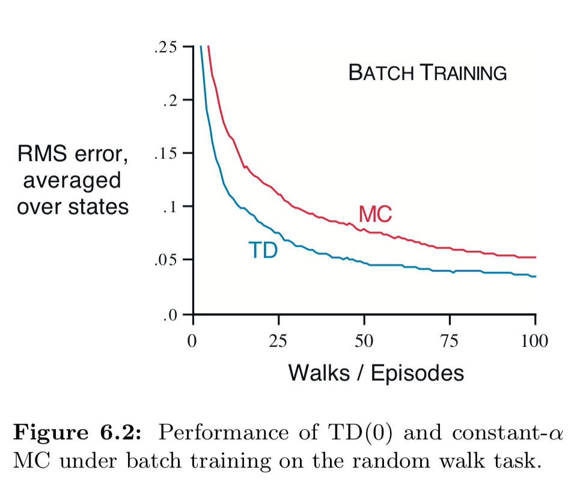

## Chapter 6: Temporal-Difference Learning 

### 6.1 TD Prediction 

- Constatnt-$\alpha$ MC

- $$
  V(S_t)\leftarrow V(S_t)+\alpha(G_t-V(S_t))
  $$

- TD(0), or one-step TD

- $$
  V(S_t)\leftarrow V(S_t)+\alpha(R_{t+1}+\gamma V(S_{t+1})-S_t)
  $$

TD(0) based on existing estimates, so it's a *bootstrapping* method.

### 6.2 Advantages of TD Prediction Methods 

- **Compared to DP**: Do not need a model of the environment
- **Compared to MC**: Online, fully incremental
- TD(0) has been proved to converge to $v_\pi(s)$.
- In practice, TD methods usually converge faster than constant-$\alpha$ MC methods on stochastic tasks.

### 6.3 Optimality of TD(0)  

- **Batch-updating**: In a finite amount of experience (episodes), increments are computed in every time step but the value function is updated only once, by the sum of all increments.

Under batch-updating, if $\alpha$ is sufficiently small, both TD(0) and constant-$\alpha$ MC deterministically converges, but to two different answers.

Under batch-updating, constant-$\alpha$ MC converges to optimal value function, but TD(0) still manages to outperform it?

- MC is optimal only in a limited way and TD is optimal in a way that is more relevent to predicting returns.
- MC minimizes mean-square error on training set while TD finds the estimates that would be exactly correct for the maximum-likelihood model of the Markov process.

**Certainty-equivalence estimate**: The estimate of the underlying process was known with certainty rather than being approximated.

### 6.4 Sarsa: On-policy TD Control 

$$
Q(S_t,A_t)\leftarrow Q(S_t,A_t)+\alpha[R_{t+1}+\gamma Q(S_{t+1}, A_{t+1})-Q(S_t,A_t)]
$$

Uses $(S_{t}, A_{t}, R_{t+1}, S_{t+1}, A_{t+1})$(SARSA).

### 6.5 Q-learning: Off-policy TD Control 

$$
Q(S_t,A_t)\leftarrow Q(S_t,A_t)+\alpha[R_{t+1}+\gamma \max_a Q(S_{t+1}, a)-Q(S_t,A_t)]
$$

Q-learning directly approximates $q_*$ , independent of the policy.

### 6.6 Expected Sarsa 

$$
\begin{aligned}
Q(S_t,A_t)&\leftarrow Q(S_t,A_t)+\alpha[R_{t+1}+\gamma\mathbb{E}[Q(S_{t+1},A_{t+1}\mid S_{t+1})]-Q(S_t,A_t)]\\
&\leftarrow Q(S_t,A_t)+\alpha[R_{t+1}+\gamma\sum_a\pi(a\mid S_{t+1})Q(S_{t+1},a)-Q(S_t,A_t)]
\end{aligned}
$$

This algorithm moves *deterministically* in the same direction as Sarsa moves *in expectation*.

If $\pi$ is greedy, it is the same as Q-learning.

### 6.7 Maximization Bias and Double Learning 

In many algorithms a maximization over estimated values is used, thus introduces a *postive bias*. This bias gives our algorithm a tendancy to explore the biased actions.

**Double-learning**: Learn two independent estimates $Q_1(a)$ and $Q_2(a)$. We can use $Q_1$ to determine the maximization action $A^*=\arg\max_aQ_1(a)$ and the other, $Q_2$, to provide the estimated value, $Q_2(A^*)=Q_2(\arg\max_aQ_1(a))$.