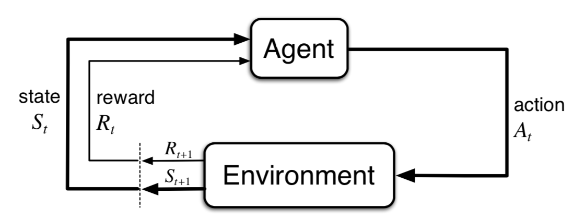
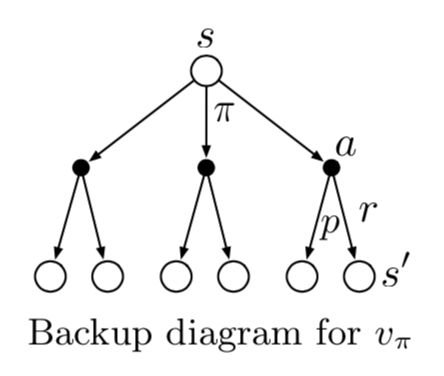
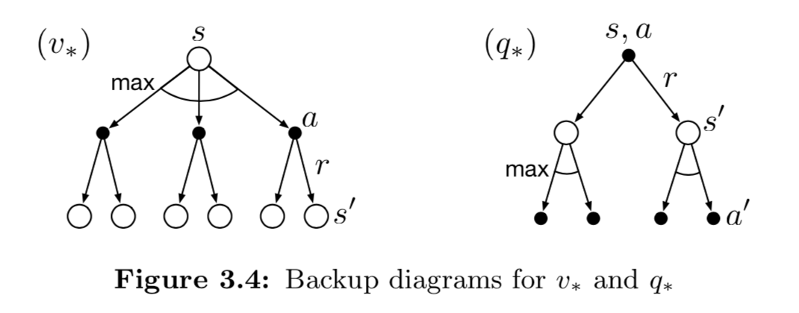
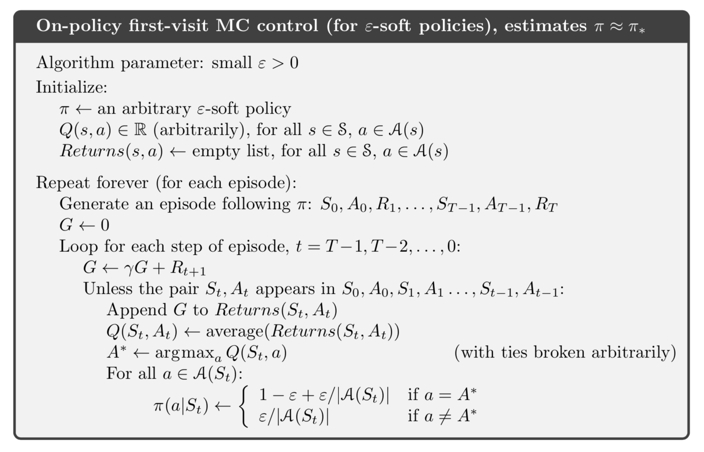
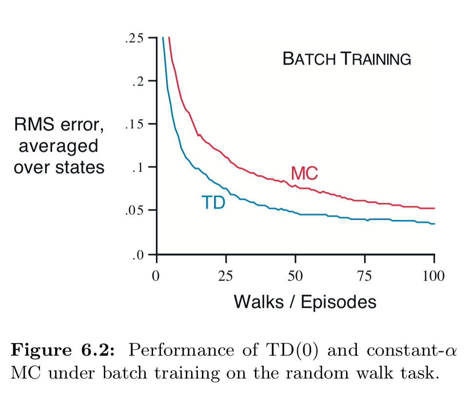

## Chapter 2: Multi-armed Bandits

### 2.1 A k-armed Bandit Problem

#### game rule 

- $k$ options, each has a random numerical reward 
- **objective**: maximize expected total reward over time

### 2.2 Action-value Methods

#### *Sample-average* method 

$$
Q_t(a)\doteq\frac{\text{sum of rewards when $a$ taken prior to $t$}}{\text{number of times $a$ taken prior to $t$}}=\frac{\sum_{i=1}^{t-1}R_i\cdot\mathbb{1}_{A_i=a}}{\sum_{i=1}^{t-1}\mathbb{1}_{A_i=a}}
$$
$Q_t(a)$ converges to $q_*(a)$ when the denominator goes to infinity.

- *greedy* action method

$$
A_t\doteq\mathop{\arg \max}_xQ_t(a)
$$

No exporation, only exploitation

- *$\epsilon$-greedy* action method

  With probability $\epsilon$, choose an action randomly equiprobably.

### 2.3 The 10-armed Testbed

$\epsilon$-greedy betters off greedy when:

- reward variance is large
- reward is nonstationary

### 2.4 Incremental Implementation 

$$
\begin{aligned}
Q_{n+1}&=\frac{1}{n}\sum_{i=1}^nR_i\\
&=\frac{1}{n}\left(R_n+(n-1)\frac{1}{n-1}\sum_{i=1}^{n-1}R_i\right)\\
&=\frac{1}{n}\left(R_n+(n-1)Q_n\right)\\
&=Q_n+\frac{1}{n}[R_n-Q_n]
\end{aligned}
$$

The general form of it is:
$$
\text{NewEstimate}\leftarrow\text{OldEstimate}+\text{StepSize}[\text{Target}-\text{OldEstimate}]
$$
The expression $[\text{Target}-\text{OldEstimate}]$ is an *error* in the estimate.

$\text{StepSize}$ is denoted as $\alpha$ or $\alpha_t(a)$.

### 2.5 Tracking a Nonstationary Problem 

If we take constant $\text{StepSize}$ $\alpha \in (0,1]$, we have:
$$
Q_{n+1}\doteq Q_n+\alpha[R_n-Q_n]
$$
And thus
$$
\begin{aligned}
Q_{n+1}&=Q_n+\alpha[R_n-Q_n]\\
&=\alpha R_n+(1-\alpha)Q_n\\
&=\alpha R_n+(1-\alpha)\alpha R_{n-1}+(1-\alpha)^2Q_{n-1}\\
&\cdots\\
&=(1-\alpha)^n Q_1+\sum_{i=1}^n\alpha(1-\alpha)^{n-i} R_i
\end{aligned}
$$
In this case, $Q_{n+1}$ is called an *exponential recency-weighted average* of past rewards and $Q_1$.

#### $\{\alpha_n(a)\}$ convergence condition

A well-known result in stochastic approximation theory gives us the conditions required to assure convergence with probability 1:
$$
\sum_{n=1}^{\infty}\alpha_n(a)=\infty\ \ \text{and}\ \ \sum_{n=1}^{\infty}\alpha_n^2(a)<\infty
$$

- The first condition is required to guarantee that the steps are large enough to eventually overcome any initial conditions or random fluctuations. 
- The second condition guarantees that eventually the steps become small enough to assure convergence. 

1. In sample average method, $\alpha_n(a)=\frac{1}{n}$ is bound to converge.
2. Constant $\alpha_n(a)=\alpha$ may not converge, but can respond to changes in non-stationary setup well. *Non-stationary problems are common in RL.*

### 2.6 Optimistic Initial Values

#### Initial Bias

*Initial bias*: The dependence of $Q_1(a)$

Choosing optimistic(high) initial values encourages exploration. All actions will be tried several times before converge.

This trick is effective on stationary problems but far from being a generally useful approach to encouraging exploration.

- In Non-stationary problems, its drive for exploration is temporary.

### 2.7 Upper-Confidence-Bound Action Selection

$$
A_t(a)\doteq\mathop{\arg\max}_a\left[Q_t(a)+c\sqrt{\frac{\ln t}{N_t(a)}}\right]
$$

$Q_t(a)+c\sqrt{\frac{\ln t}{N_t(a)}}$ is the upper-bound of $q_*(a)$ with confidence level $c$. This method takes uncertainty into consideration.

The requirement of storing $N_t(a)$ makes it impractical in large action space problems.

### 2.8 Gradient Bandit Algorithms

Another approach instead of $Q_t(a)$: learning a numerical *preference* function $H_t(a)$ overtime to determine the probability of choosing the action, according to *soft-max distribution*.
$$
\Pr\{A_t=a\}\doteq\frac{e^{H_t(a)}}{\sum_{b=1}^ke^{H_t(b)}}\doteq\pi_t(a)
$$
$H_t(a)$ can be updated using stochastic gradient ascent:
$$
\begin{aligned}
H_{t+1}(A_t)&\doteq H_t(A_t)+\alpha(R_t-\bar{R}_t)(1-\pi_t(A_t)), &&\text{and}\\
H_{t+1}(a)&\doteq H_t(a)-\alpha(R_t-\bar{R}_t)\pi_t(a), &&\text{for all }a\neq A_t
\end{aligned}
$$
$\bar{R}_t(a)$ is the average of all the rewards up through and including time $t$. It serves as the baseline of rewards. If current reward exceeds the baseline, the preference increases.

#### How to compute the gradient

We want to have 
$$
H_{t+1}(a)\doteq H_{t}(a)+\alpha\frac{\partial\mathbb{E}[R_t]}{\partial H_t(a)}
$$
Where
$$
\mathbb{E}[R_t]=\sum_x\pi_t(x)q_*(x)
$$
Of course, it is not possible to implement gradient ascent exactly in our case because by assumption we do not know the $q_*(x)$, but in fact the updates of our algorithm are equal to the equation above in **expected value**, making the algorithm an instance of *stochastic gradient ascent*. 
$$
\begin{aligned}
\frac{\partial\mathbb{E}[R_t]}{\partial H_t(a)}&=\frac{\partial}{\partial H_t(a)}\left(\sum_x\pi_t(x)q_*(x)\right)&\\
&=\sum_xq_*(x)\frac{\partial\pi_t(x)}{\partial H_t(a)}&\\
&=\sum_x\left(q_*(x)-B_t\right)\frac{\partial\pi_t(x)}{\partial H_t(a)}&\Leftarrow\sum_x\frac{\partial\pi_t(x)}{\partial H_t(a)}=0\\
\end{aligned}
$$
$B_t$ is the *baseline* mentioned above, in this case it is $\bar{R}_t$. We can now proceed and turn this equation into an expectation.
$$
\begin{aligned}
\frac{\partial\mathbb{E}[R_t]}{\partial H_t(a)}&=\sum_x\left(q_*(x)-B_t\right)\pi_t(x)\frac{\partial\pi_t(x)}{\partial H_t(a)}/\pi_t(x)&&\\
&=\mathbb{E}[(q_*(A_t)-B_t)\frac{\partial\pi_t(A_t)}{\partial H_t(a)}/\pi_t(A_t)]&&\Leftarrow A_t\leftarrow x\\
&=\mathbb{E}[(R_t-\bar{R}_t)\frac{\partial\pi_t(A_t)}{\partial H_t(a)}/\pi_t(A_t)]&&\Leftarrow \mathbb{E}[R_t| A_t]=q_*(A_t)
\end{aligned}
$$
Now we take a look at the $\frac{\partial\pi_t(A_t)}{\partial H_t(a)}$.
$$
\begin{aligned}
\frac{\partial\pi_t(A_t)}{\partial H_t(a)}&=\frac{\partial}{\partial H_t(a)}\left(\frac{e^{H_t(A_t)}}{\sum_be^{H_t(b)}}\right)\\
&=\left\{
\begin{array}{ll}
-\pi_t(A_t)\pi_t(a),&A_t\neq a\\
\pi_t(A_t)-\pi_t(A_t)\pi_t(a),&A_t=a
\end{array}
\right.\\
&=\pi_t(A_t)(\mathbb{1}_{A_t=a}-\pi_t(a))
\end{aligned}
$$
Finally
$$
\begin{aligned}
\frac{\partial\mathbb{E}[R_t]}{\partial H_t(a)}&=\mathbb{E}[(R_t-\bar{R}_t)\pi_t(A_t)(\mathbb{1}_{A_t=a}-\pi_t(a))/\pi_t(A_t)]\\
&=\mathbb{E}[(R_t-\bar{R}_t)(\mathbb{1}_{A_t=a}-\pi_t(a))]
\end{aligned}
$$
## Chapter 3: Finite Markov Decision Process

From k-armed bandit problem: single state $\Rightarrow$ multiple state.

### 3.1 The Agent-Environment Interface

- **Agent**: The learner and decision maker 
- **Environment**: The thing it interacts with, comprising everything outside the agent

The **trajectory**:
$$
S_0,A_0,R_1,S_1,A_1,R_2,S_2,A_2,R_3,\dots
$$

#### Dynamics of MDP

Function $p$:
$$
p(s',r\mid s, a)\doteq\Pr\{S_t=s',R_t=r\mid S_{t-1}=s, A_{t-1}=a\}
$$
defines the *dynamics* of MDP. The conditional probability notation here is just a reminder of 
$$
\sum_{s'\in\mathcal{S}}\sum_{r\in\mathcal{R}}p(s',r\mid s,a)=1\text{, for all }s\in\mathcal{S}, a\in\mathcal{A}(s)
$$
This *dynamics* is not a constraint on the decision process but rather a constraint on states, which means the states must contains all informations of past states and actions. This property is called a *Markov property*.

The four-argument dynamics function $p$ has some other useful forms.

- *state-transition probabilities*:
  $$
  p(s'\mid s,a)=\Pr\{S_t=s'\mid S_{t-1}=s, A_{t-1}=a\}=\sum_{r\in\mathcal{R}}p(s',r\mid s, a)
  $$

- expected reward:

- $$
  r(s, a)=\mathbb{E}[R_t\mid S_{t-1}=s, A_{t-1}=a]=\sum_{r\in\mathcal{R}}r\sum_{s\in\mathcal{S}}p(s',r\mid s, a)
  $$

  $$
  r(s, a, s')=\mathbb{E}[R_t\mid S_{t-1}=s, A_{t-1}=a, S_t=s]=\sum_{r\in\mathcal{R}}r\frac{p(s',r\mid s, a)}{p(s'\mid s,a)}
  $$

#### The agent-environment boundary

- The boundary represents the limit of the agent's *absolute control*, not of its knowledge.
- The boundary is determined once one has selected particular states, actions, and rewards, and thus has identified a specific decision making task of interest 

### 3.2 Goals and Rewards

**Reward hypothesis**: That all of what we mean by goals and purposes can be well thought of as the maximization of the expected value of the cumulative sum of a received scalar signal (called reward). 

The reward signal is your way of communicating to the robot *what* you want it to achieve, not *how* you want it achieved.

### 3.3 Returns and Episodes

- **Return**:
  $$
  G_t\doteq R_{t+1}+R_{t+2}+R_{t+3}+\cdots+R_T
  $$
  Where $T$ is a final time step.

- **Episode**: the agent–environment interaction breaks naturally into subsequences 

- **Episodic tasks**: Tasks with episodes (finite time step)

- **Continuous tasks**: Final stime step $T=\infty$, the return form above may easily result in inifity reward.

- **Discounted return**:
  $$
  \begin{aligned}
  G_t&\doteq R_{t+1}+\gamma R_{t+2}+\gamma^2R_{t+3}+\cdots=\sum_{k=0}^\infty\gamma^kR_{t+k+1}\\
  &=R_{t+1}+\gamma G_{t+1}
  \end{aligned}
  $$

### 3.5 Policies and Value Functions

- **Policy**: 

- $$
  \pi(a| s)=\Pr[A_t=a\mid S_t=s]
  $$

- **State-value function for policy $\pi$**:

- $$
  v_{\pi}(s)\ \doteq\ \mathbb{E}_\pi[G_t\mid S_t=s]\ =\ \mathbb{E}_\pi\left[\left.\sum_{k=0}^\infty\gamma^kR_{t+k+1}\right\vert S_t=s\right]\text{ , for all }s\in\mathcal{S}
  $$

- **State-value function for policy $\pi$**:

- $$
  q_\pi(s,a)\ \doteq\ \mathbb{E}_\pi[G_t\mid S_t=s, A_t=a]\ =\ \mathbb{E}_\pi\left[\left.\sum_{k=0}^\infty\gamma^kR_{t+k+1}\right|S_t=s, A_t=a\right]
  $$

- **Monte Carlo methods**: fix $\pi$, averaging over random samples of $v_\pi$ or $q_\pi$.

When state space is too large, we can maintain $v_\pi$ and $q_\pi$ as parameterized functions (with fewer parameters than states).

Value functions also have recursive relationships, thus can be applied in dynamic programming.

- **Bellman Equation**

- $$
  \begin{aligned}
  v_\pi(s)&\doteq \mathbb{E}_\pi[G_t\mid S_t=s]\\
  &=\mathbb{E}_\pi[R_{t+1}+\gamma G_{t+1}\mid S_t=t]\\
  &=\sum_a\pi(a\mid s)\sum_{s'}\sum_r p(s', r\mid s,a)[r+\gamma\mathbb{E}_\pi[G_{t+1}\mid S_{t+1}=s']]\\
  &=\sum_a\pi(a\mid s)\sum_{s',r} p(s', r\mid s,a)[r+\gamma v_\pi(s')]\\
  \\
  q_\pi(s, a)&\doteq\mathbb{E}_\pi[G_t\mid S_t=s, A_t=a]\\
  &=\sum_{s',r}p(s',r\mid s,a)\left[r+\gamma\sum_{a'}\pi(a'\mid s')q_\pi(s', a')\right]
  \end{aligned}
  $$

- **Backup (update) diagram**

  *Backup operations*: transfer value information back to a state (or a state–action pair) from its successor states (or state–action pairs) 

### 3.6 Optimal Policies and Optimal Value Functions 

Frist define a *partial order* between policies $\pi$ and $\pi'$:
$$
\pi \geq \pi'\text{ if and only if }v_\pi(s)\geq v_{\pi'}(s)\text{ for all } s\in\mathcal{S}
$$
There is always *at least one* policy that is better than or equal to all other policies. They all are **optimal policy** $\pi_*$. They share the same state-value function, called the **optimal state-value function** $v_*$:
$$
v_*(s)\doteq\max_\pi v_\pi(s)\text{,  for all } s \in \mathcal{S}
$$
and **optimal action-value function** $q_*$:
$$
q_*(s,a)\doteq\max_\pi q_\pi(s, a)\text{, for all }s\in\mathcal{S}\text{ and }a\in\mathcal{A}(s)
$$
**Bellman optimality equation**:

- $$
  \begin{aligned}
  v_*(s)&=\max_{a\in\mathcal{A}(s)}q_*(s,a)\\
  &=\max_{a}\mathbb{E}_{\pi_*}[G_t\mid S_t=s, A_t=a]\\
  &=\max_{a}\mathbb{E}_{\pi_*}[R_{t+1}+\gamma G_{t+1}\mid S_t=s, A_t=a]\\
  &=\max_{a}\mathbb{E}[R_{t+1}+\gamma v_*(S_{t+1})\mid S_t=s, A_t=a]\\
  &=\max_a\sum_{s',r}p(s',r\mid s, a)[r+\gamma v_*(s')]\\
  \\
  q_*(s,a)&=\mathbb{E}[R_{t+1}+\gamma\max_{a'}q_*(S_{t+1},a')\mid S_t=s, A_t=a]\\
  &=\sum_{s',r}p(s',r\mid s,a)\left[r+\gamma\max_{a'}q_*(s',a')\right]
  \end{aligned}
  $$

  

### 3.7 Optimality and Approximation 

Solving optimality Bellman equation to solve RL problem is **impractical**, because

1. We have to accurately know environment dynamics ( $p(s', r\mid s, a)$).
2. The computational cost & memory required is massive.
3. The true Markov property is rare.

So *approximations* are often necessary.

1. parameterized function representation 
2. focues on frequently encountered states

## Chapter 5: Monte Carlo Methods

### 5.1 Monte Carlo Prediction

- **First-visit MC method**: the return is taken by the first occurrence of $s$ in the episode.
- **Every-visit MC method**: the return is taken by every occurrences of $s$ in the episode.

In first-visit MC method, every sample of $V(s)$ are independent with each other.

1. Estimates for states are independent. (do not *bootstrap*)
2. Ability to learn from actual experience and from simulated experience.
3. Its computational expense of estimating the value of
   a single state is independent of the number of states.

### 5.2 Monte Carlo Estimation of Action Values

Estimation of action values is useful when the model is not completely known.

**Complication** (vs estimation for value function): many state–action pairs may never be visited. $\Rightarrow$ *maintain exploration*

- **Exploring starts**:  specifying that the episodes start in a state–action pair, and that every pair has a nonzero probability of being selected as the start.
- Consider only policies that are stochastic with a nonzero probability of selecting all actions in each state.

### 5.3 Monte Carlo Control

**Monte Carlo ES** (with exploring starts): alternate between evaluation and improvement on an episode-by-episode basis

### 5.4 Monte Carlo Control without Exploring Starts

- **On-policy methods**: to evaluate or improve the policy that is used to make decisions.
- **Off-policy methods**: to evaluate or improve the policy different from the policy that is used to make decisions.

----

#### On-policy learning

- **$\varepsilon$-soft policy**: $\pi(a|s)\geq \frac{\varepsilon}{|\mathcal{A}(s)|}$ for all states and actions.
- **$\varepsilon$-greedy policy**: take optimal action with probability $1-\varepsilon$, take random action with probability $\frac{\varepsilon}{|\mathcal{A}(s)|}$ each. *(instance of $\varepsilon$-soft policy)*
- $\widetilde{v}_\pi$: behave like original policy with probability $1-\varepsilon$, take random action with probability $\frac{\varepsilon}{|\mathcal{A}(s)|}$ each. 

### 5.5 Off-policy Prediction via Importance Sampling 

*Dilemma*: They seek to learn action values conditional on subsequent optimal behavior, but they need to behave non-optimally in order to explore all actions **(Exploration-Exploitation)**

#### Off-policy learning

- **Target policy**: the policy being learned about
- **Behavior policy**: the policy used to generate behavior

Off-policy methods are often of greater variance and are slower to converge.

Can be applied to learn from data generated by a conventional non-learning controller, or from a human expert. 

##### Prediction problem: 

both target policy $\pi$ and behavior policy $b$ are fixed and given, we need to estimate $v_\pi$ or $q_\pi$.

- Assumption of converge: $\pi(a|s)>0$ shoule imply $b(a|s)>0$.

- **Importance sampling** ratio: the relative probability of their trajectories occurring under the target and behavior policies

- $$
  \begin{aligned}
  \Pr\{A_t,S_{t+1},A_{t+1},\dots,S_T\mid S_t, A_{t:T-1}\sim\pi\}\\
  =\prod_{k=t}^{T-1}\pi(A_k|S_k)p(S_{k+1}|S_k,A_k)
  \end{aligned}
  $$

- $$
  \rho_{t:T-1}\doteq\frac{\prod_{k=t}^{T-1}\pi(A_k|S_k)p(S_{k+1}|S_k,A_k)}{\prod_{k=t}^{T-1}b(A_k|S_k)p(S_{k+1}|S_k,A_k)}=\prod_{k=t}^{T-1}\frac{\pi(A_k|S_k)}{b(A_k|S_k)}
  $$

  *Why importance sampling?*

  In returns (based on behavior policy) the expectation is wrong and thus cannot be averaged to obtain $v_\pi(s)$
  $$
  \mathbb{E}[G_t|S_t=s]=v_b(s)
  $$
  When importance sampling ratio $\rho_{t:T-1}$ is applied:
  $$
  \mathbb{E}[\rho_{t:T-1}G_t|S_t=s]=v_\pi(s)
  $$

Some notations:

- We can number the time steps continously across the episode boundary in a batch.
- $\mathcal{T}(s)$ - all timesteps when $s$ is visited (only first occurrences if first-visit)
- $T(t)$ - first termination following timestep $t$

Ordinary importance sampling:
$$
V(s)\doteq\frac{\sum_{t\in\mathcal{T}(s)}\rho_{t:T-1}G_t}{|\mathcal{T}(s)|}
$$
Weighted importance sampling:
$$
V(s)\doteq\frac{\sum_{t\in\mathcal{T}(s)}\rho_{t:T-1}G_t}{\sum_{t\in\mathcal{T}(s)}\rho_{t:T-1}}
$$
**In first-visit methods**

- Ordinary importance sampling is unbiased. But its variance is unbounded due to unbounded ratio $\rho$. *This method is useful in approximation methods.*
- Weighted imporatance sampling is biased (consider if $\mathcal{T}(s)=1$ the estimate $V(s)=v_b(s)\neq v_\pi(s)$) but the bias converges to $0$. Its variance is bounded because the weight of each return is at most $1$. And the variance converges to $0$ even if $\rho_{t:T-1}$ is infinity. *This method is more often preferred.*

In every-visit methods both methods are biased and the bias converges to $0$. *In practice every-visit methods are preferred* because it need not to keep track of the ocurrance of each state.

### 5.6 Incremental Implementation

In case of on-policy learning and ordinary importance sampling of off-policy learning, the incremental implementation is the same as in multi-armed bandit games.

In weighted importance sampling:
$$
\begin{aligned}
V_{n+1}&\doteq V_n+\frac{W_n}{C_n}[G_n-V_n]\\
C_{n+1}&\doteq C_n+W_{n+1}
\end{aligned}
$$
## Chapter 6: Temporal-Difference Learning 

### 6.1 TD Prediction 

- Constatnt-$\alpha$ MC

- $$
  V(S_t)\leftarrow V(S_t)+\alpha(G_t-V(S_t))
  $$

- TD(0), or one-step TD

- $$
  V(S_t)\leftarrow V(S_t)+\alpha(R_{t+1}+\gamma V(S_{t+1})-S_t)
  $$

TD(0) based on existing estimates, so it's a *bootstrapping* method.

### 6.2 Advantages of TD Prediction Methods 

- **Compared to DP**: Do not need a model of the environment
- **Compared to MC**: Online, fully incremental
- TD(0) has been proved to converge to $v_\pi(s)$.
- In practice, TD methods usually converge faster than constant-$\alpha$ MC methods on stochastic tasks.

### 6.3 Optimality of TD(0)  

- **Batch-updating**: In a finite amount of experience (episodes), increments are computed in every time step but the value function is updated only once, by the sum of all increments.

Under batch-updating, if $\alpha$ is sufficiently small, both TD(0) and constant-$\alpha$ MC deterministically converges, but to two different answers.

Under batch-updating, constant-$\alpha$ MC converges to optimal value function, but TD(0) still manages to outperform it?

- MC is optimal only in a limited way and TD is optimal in a way that is more relevent to predicting returns.
- MC minimizes mean-square error on training set while TD finds the estimates that would be exactly correct for the maximum-likelihood model of the Markov process.

**Certainty-equivalence estimate**: The estimate of the underlying process was known with certainty rather than being approximated.

### 6.4 Sarsa: On-policy TD Control 

$$
Q(S_t,A_t)\leftarrow Q(S_t,A_t)+\alpha[R_{t+1}+\gamma Q(S_{t+1}, A_{t+1})-Q(S_t,A_t)]
$$

Uses $(S_{t}, A_{t}, R_{t+1}, S_{t+1}, A_{t+1})$(SARSA).

### 6.5 Q-learning: Off-policy TD Control 

$$
Q(S_t,A_t)\leftarrow Q(S_t,A_t)+\alpha[R_{t+1}+\gamma \max_a Q(S_{t+1}, a)-Q(S_t,A_t)]
$$

Q-learning directly approximates $q_*$ , independent of the policy.

### 6.6 Expected Sarsa 

$$
\begin{aligned}
Q(S_t,A_t)&\leftarrow Q(S_t,A_t)+\alpha[R_{t+1}+\gamma\mathbb{E}[Q(S_{t+1},A_{t+1}\mid S_{t+1})]-Q(S_t,A_t)]\\
&\leftarrow Q(S_t,A_t)+\alpha[R_{t+1}+\gamma\sum_a\pi(a\mid S_{t+1})Q(S_{t+1},a)-Q(S_t,A_t)]
\end{aligned}
$$

This algorithm moves *deterministically* in the same direction as Sarsa moves *in expectation*.

If $\pi$ is greedy, it is the same as Q-learning.

### 6.7 Maximization Bias and Double Learning 

In many algorithms a maximization over estimated values is used, thus introduces a *postive bias*. This bias gives our algorithm a tendancy to explore the biased actions.

**Double-learning**: Learn two independent estimates $Q_1(a)$ and $Q_2(a)$. We can use $Q_1$ to determine the maximization action $A^*=\arg\max_aQ_1(a)$ and the other, $Q_2$, to provide the estimated value, $Q_2(A^*)=Q_2(\arg\max_aQ_1(a))$.## Chapter 9: On-policy Prediction with Approximation

$$
\hat{v}(s,\mathbf{w})\approx v_\pi(s)
$$

## Chapter 9: On-policy Prediction with Approximation

### 9.1 Value-function Approximation

- **Update target**: $s\mapsto u$

  - Monte Carlo: $S_t\mapsto G_t$
  - TD(0): $S_t\mapsto R_{t+1}+\gamma\hat{v}(S_{t+1},\mathbf{w}_t)$
  - DP: $s\mapsto\mathbb{E}_\pi[R_{t+1}+\gamma\hat{v}(S_{t+1}, \mathbf{w}_t)\mid S_t=s]$

  To mimic the input-output ($s$,$u$): **supervised learning**.

  When output is a number: **function approximation**.

- Methods that cannot easily handle such **non-stationarity** are less suitable for
  reinforcement learning.

### 9.2 The Prediction Objective ($\overline{\text{VE}}$)

- **State distribution** (How much we care about the error is each state): $\mu(s)\geq0, \sum_s \mu(s)=1$.

- **Mean Squared Value Error**:
  $$
  \overline{\text{VE}}(\mathbf{w})\doteq\sum_{s\in\mathcal{S}}\mu(s)[v_\pi(s)-\hat{v}(s,\mathbf{w})]^2
  $$

  - The root $\overline{\text{VE}}$ is often used in plots.

  - $\mu(s)$ is often chosen to be the fraction of time spent in $s$. **(On-policy distribution)**

    - In a continuing task, the on-policy distribution is the stationary distribution under policy $\pi$.

    - In a episodic task, first we denote the probability that an episode starts at $s$ as $h(s)$, and the average time spent on state $s$ in an episode as $\eta(s)$.
      $$
      \eta(s)=h(s)+\sum_{\overline{s}}\eta(\overline{s})\sum_{a}\pi(a|\overline{s})p(s|\overline{s},a)
      $$

    - We can solve for $\eta(s)$, then 
      $$
      \mu(s)=\frac{\eta(s)}{\sum_{s'}\eta(s')}
      $$

    - 

## Chapter 12: Eligibility Traces

### 12.1 The $\lambda$-return

$$
G_{t:t+n}\doteq R_{t+1}+\gamma R_{t+2}+\cdots+\gamma^{n-1}R_{t+n}+\gamma^n\hat{v}(S_{t+n},\mathbf{w}_{t+n-1})
$$

- **$\lambda$-return**:
  $$
  \begin{aligned}
  G_t^\lambda&\doteq(1-\lambda)\sum_{n=1}^\infty\lambda^{n-1}G_{t:t+n}\\
  &\doteq(1-\lambda)\sum_{n=1}^{T-t-1}\lambda^{n-1}G_{t:t+n}+\lambda^{T-t-1}G_t
  \end{aligned}
  $$

- Offline $\lambda$-return algorithm 
  $$
  \mathbf{w}_{t+1}\doteq\mathbf{w}_t+\alpha[G_t^\lambda-\hat{v}(S_t,\mathbf{w}_t)]\nabla\hat{v}(S_t,\mathbf{w}_t)
  $$

### 12.2 TD($\lambda$)

- **Eligibility trace** (accumulating trace)

$$
\begin{aligned}
\mathbf{z}_{-1}&\doteq\mathbf{0}\\
\mathbf{z}_t&\doteq\gamma\lambda\mathbf{z}_{t-1}+\nabla\hat{v}(S_t,\mathbf{w}_t)
\end{aligned}
$$

- **TD($\lambda$)**

$$
\delta_t\doteq R_{t+1}+\gamma\hat{v}(S_{t+1},\mathbf{w}_t)-\hat{v}(S_t,\mathbf{w}_t)
$$

$$
\mathbf{w}_{t+1}\doteq\mathbf{w}_t+\alpha\delta_t\mathbf{z}_t
$$

- Convergence

$$
\overline{\text{VE}}(\mathbf{w}_\infty)\leq\frac{1-\gamma\lambda}{1-\gamma}\min_{\mathbf{w}}\overline{\text{VE}}(\mathbf{w})
$$

### 12.3 $n$-step Truncated $\lambda$-return Methods

- Truncated $\lambda$-return

$$
G_{t:h}^\lambda\doteq(1-\lambda)\sum_{n=1}^{h-t-1}\lambda^{n-1}G_{t:t+n}+\lambda^{h-t-1}G_t
$$

- TTD($\lambda$)
  $$
  \mathbf{w}_{t+n}\doteq\mathbf{w}_{t+n-1}+\alpha[G_{t:t+n}^\lambda-\hat{v}(S_t,\mathbf{w}_{t+n-1})]\nabla\hat{v}(S_t,\mathbf{w}_{t+n-1})
  $$

- Efficient implementation

$$
G_{t:t+k}^\lambda=\hat{v}(S_t,\mathbf{w}_{t-1})+\sum_{i=t}^{t+k-1}(\gamma\lambda)^{i-t}\delta'_i
$$

Where
$$
\delta'_t\doteq R_{t+1}+\gamma\hat{v}(S_{t+1},\mathbf{w}_{t})-\hat{v}(S_t,\mathbf{w}_{t-1})
$$

### 12.4 Redoing Updates: Online $\lambda$-return Algorithm

- $\mathbf{w}_t^h$ denotes the weights used to generate the value at time $t$ in the sequence up to
  horizon $h$.
  $$
  \begin{aligned}
  h=1:\ \ &\mathbf{w}_1^1\doteq\mathbf{w}_0^1+\alpha[G_{0:1}^\lambda-\hat{v}(S_0,\mathbf{w}_0^1)]\nabla\hat{v}(S_0,\mathbf{w}_0^1)\\
  \\
  h=2:\ \ &\mathbf{w}_1^2\doteq\mathbf{w}_0^2+\alpha[G_{0:2}^\lambda-\hat{v}(S_0,\mathbf{w}_0^2)]\nabla\hat{v}(S_0,\mathbf{w}_0^2)\\
  &\mathbf{w}_2^2\doteq\mathbf{w}_1^2+\alpha[G_{1:2}^\lambda-\hat{v}(S_1,\mathbf{w}_1^2)]\nabla\hat{v}(S_1,\mathbf{w}_1^2)\\
  \end{aligned}
  $$

- General form:
  $$
  \mathbf{w}_{t+1}^h\doteq\mathbf{w}_t^h+\alpha[G_{t:h}^\lambda-\hat{v}(S_t,\mathbf{w}_t^h)]\nabla\hat{v}(S_t,\mathbf{w}_t^h)
  $$

### 12.5 True Online TD($\lambda$)

In online $\lambda$-return algorithm, we compute the triangle
$$
\begin{array}{cccccc}
\mathbf{w}_0^0\\
\mathbf{w}_0^1&\mathbf{w}_1^1\\
\mathbf{w}_0^2&\mathbf{w}_1^2&\mathbf{w}_2^2\\
\mathbf{w}_0^3&\mathbf{w}_1^3&\mathbf{w}_2^3&\mathbf{w}_3^3\\
\vdots&\vdots&\vdots&\vdots&\ddots\\
\mathbf{w}_0^T&\mathbf{w}_1^T&\mathbf{w}_2^T&\mathbf{w}_3^T&\cdots&\mathbf{w}_T^T\\
\end{array}
$$
at high computational cost. We can actually directly compute $\mathbf{w}_{t+1}^{t+1}$ from $\mathbf{w}_t^t$. In linear case $\hat{v}(s,\mathbf{w})=\mathbf{w}^\top\mathbf{x}(s)$:
$$
\mathbf{w}_{t+1}\doteq\mathbf{w}_t+\alpha\delta_t\mathbf{z}_t+\alpha(\mathbf{w}_t^\top\mathbf{x}_t-\mathbf{w}_{t-1}^\top\mathbf{x}_t)(\mathbf{z}_t-\mathbf{x}_t)
$$
where $\mathbf{x}_t\doteq\mathbf{x}(S_t)$, $\delta_t$ is the same as defined in TD($\lambda$), $\mathbf{z}_t$ here is *dutch trace*:
$$
\mathbf{z}_t\doteq\gamma\lambda\mathbf{z}_{t-1}+(1-\alpha\gamma\lambda\mathbf{z}_{t-1}^\top\mathbf{x}_t)\mathbf{x}_t
$$

### 12.6 *Dutch Traces in Monte Carlo Learning

The linear version of the gradient Monte Carlo prediction algorithm:
$$
\mathbf{w}_{t+1}\doteq\mathbf{w}_t+\alpha[G-\mathbf{w}_t^\top\mathbf{x}_t]\mathbf{x}_t
$$
To simplify the example, we assume here that the return G is a single reward received at
the end of the episode (this is why G is not subscripted by time) and that there is no
discounting.

By the end of the episode:
$$
\begin{aligned}
\mathbf{w}_T&=\mathbf{w}_{T-1}+\alpha(G-\mathbf{w}_{T-1}^\top\mathbf{x}_{T-1})\mathbf{x}_{T-1}\\
&=\mathbf{w}_{T-1}+\alpha\mathbf{x}_{T-1}(-\mathbf{x}_{T-1}^\top\mathbf{w}_{T-1})+\alpha G\mathbf{x}_{T-1}\\
&=(\mathbf{I}-\alpha\mathbf{x}_{T-1}\mathbf{x}_{T}^\top)\mathbf{w}_{T-1}+\alpha G\mathbf{x}_{T-1}\\
&=\mathbf{F}_{T-1}\mathbf{w}_{T-1}+\alpha G\mathbf{x}_{T-1}
\end{aligned}
$$
where $\mathbf{F}_t\doteq\mathbf{I}-\alpha\mathbf{x}_t\mathbf{x}_t^\top$ is a *forgetting*, or *fading*, *matrix*. Now recursing,
$$
\begin{aligned}
=&\mathbf{F}_{T-1}(\mathbf{F}_{T-2}+\alpha G\mathbf{x}_{T-2})+\alpha G\mathbf{x}_{T-1}\\
&\vdots\\
=&\mathbf{F}_{T-1}\mathbf{F}_{T-2}\cdots\mathbf{F}_0\mathbf{w}_0\ +\ \alpha G\sum_{k=0}^{T-1}\mathbf{F}_{T-1}\mathbf{F}_{T-2}\cdots\mathbf{F}_{k+1}\mathbf{x}_k\\
=&\mathbf{a}_{T-1}+\alpha G\mathbf{z}_{T-1}
\end{aligned}
$$

$$
\begin{aligned}
\mathbf{z}_t&\doteq\sum_{k=0}^{t-1}\mathbf{F}_{t-1}\mathbf{F}_{t-2}\cdots\mathbf{F}_{k+1}\mathbf{x}_k\\
&=\mathbf{F}_t\mathbf{z}_{t-1}+\mathbf{x}_t\\
&=(\mathbf{I}-\alpha\mathbf{x}_t\mathbf{x}_t^\top)\mathbf{z}_{t-1}+\mathbf{x}_t\\
&=\mathbf{z}_{t-1}+(1-\alpha\mathbf{z}_{t-1}^\top\mathbf{x}_t)\mathbf{x}_t
\end{aligned}
$$

### 12.7 Sarsa($\lambda$)

$$
G_{t:t+n}\doteq R_{t+1}+\cdots+\gamma^{n-1}R_{t+n}+\gamma^n\hat{q}(S_{t+n},A_{t+n},\mathbf{w}_{t+n-1})
$$

Action-value form of offline $\lambda$-return algorithm:
$$
\mathbf{w}_{t+1}\doteq\mathbf{w}_t+\alpha[G_t^\lambda-\hat{q}(S_t,A_t,\mathbf{w}_t)]\nabla\hat{q}(S_t,A_t,\mathbf{w}_t)
$$

### 12.8 Variable $\lambda$ and $\gamma$

- $\lambda:\mathcal{S}\times\mathcal{A}\rightarrow[0,1]$, $\lambda_t\doteq\lambda(S_t,A_t)$
- $\gamma:\mathcal{S}\rightarrow[0,1]$, $\gamma_t\doteq\gamma(S_t)$